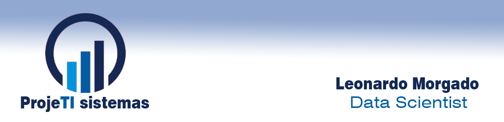

  

# Leonardo Vilor
*Data Scientist*

Data Scientist, Electrical Engineer and System Analyst. Working with consultancy in the area of property security and development of IT Projects.

*Cientista de Dados, Engenheiro Eletricista e Analista de Sistemas. Trabalhando com consultoria na área de segurança patrimonial e desenvolvimento de Projetos de TI.*

**Background in:** Python, Machine Learning, System analysis and Project development.

**Links:**
* [Site](http://projetisistemas.com.br)
* [LinkedIn](https://www.linkedin.com/in/leovilor)
* [Medium](https://medium.com/@leonardovilor)

## Projetos:

---

